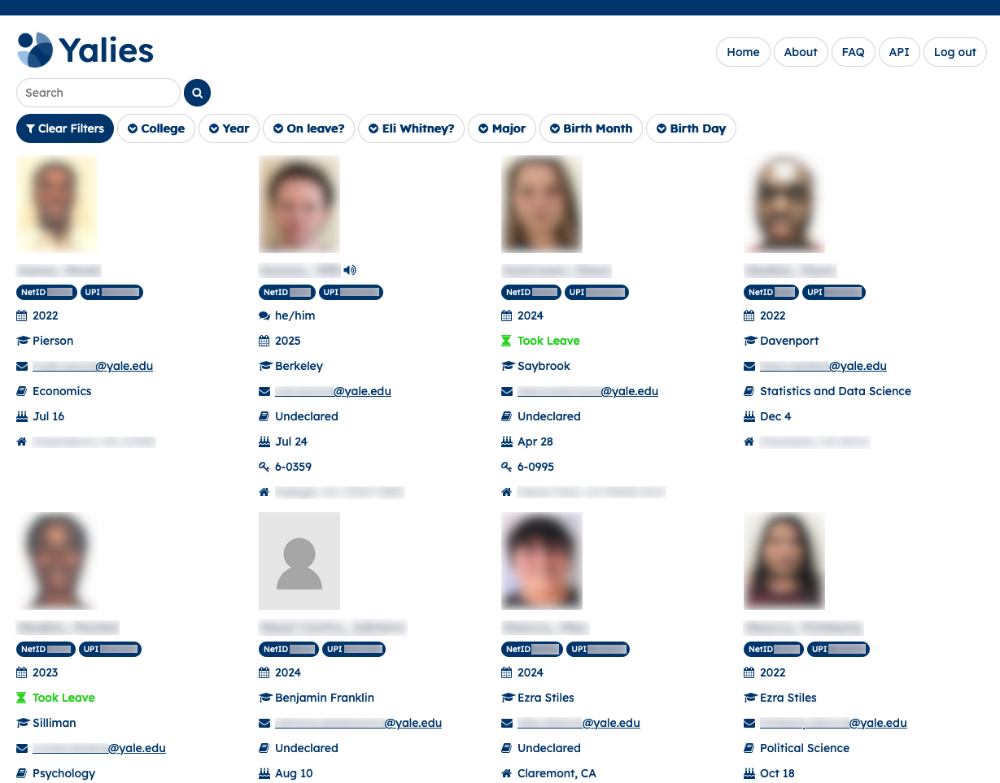

# [👥 Yalies](https://yalies.io)

> A website and API for getting information on students at Yale College.



## Initial Setup

To develop changes to the application, you'll need to run it locally for testing.

This guide assumes, as prerequisites, that you have A MacOS or Linux-based OS (if you use Windows, you can still follow along, but some commands may be different).

### Install Homebrew
- If you're on a Mac, first [install Homebrew](https://brew.sh/#install).
- If you're on Linux, follow along with your distro's package manager (`pacman`, `apt-get`, `yum`, etc).

### Install Python
This project requires Python version 3.10.7. You may already have Python on your machine—it comes preinstalled with macOS—but it may
be the wrong version.

To check your python version, run:
```bash
python3 --version
```
If it says anything other than `3.10.7`, keep following along.

We are going to use `pyenv` to install multiple versions of Python on our machine, and `pyenv-virtualenv` to manage dependencies in our package. Run:
```bash
brew install pyenv
brew install pyenv-virtualenv
```
Now, we must add pyenv to our PATH. PATH is a special bash variable that tells the shell what executables we can run.

If you're using zsh (the default for macOS nowadays), open `~/.zprofile`. in your favorite text editor If you're still using bash, edit `~/.bash_profile`. Add the following lines at the bottom:
```bash
export PATH="$PYENV_ROOT/bin:$PATH"
eval "$(pyenv init --path)"
eval "$(pyenv init -)"
eval "$(pyenv virtualenv-init -)"
```
> Note: for `fish` shell, add this to `~/.config/fish/config.fish` instead. If you don't know what fish is, ignore this.
> ```bash
> set PATH $PATH "$HOME/.pyenv/bin"
> eval "$(pyenv init --path)"
> eval "$(pyenv init -)"
> eval "$(pyenv virtualenv-init -)"
> ```

Finally, we have to tell Python to use the correct version. To tell pyenv to switch to the right version, run
```bash
pyenv install 3.10.7
pyenv global 3.10.7
```

### Install PostgreSQL
Run:
```bash
brew install postgresql
```

### Clone the repository
If you need a refresher on Git, Eric made a [Git tutorial video](https://www.youtube.com/watch?v=yZo-aF1dqhs). The video describes the workflow the development team will be using.

Clone the repo using
```bash
git clone https://github.com/Yalies/api Yalies
cd Yalies
```

> Note: If you are not a member of the Y/CS Yalies Dev Team but want to contribute, make a fork of the repo and [set upstream](https://docs.github.com/en/pull-requests/collaborating-with-pull-requests/working-with-forks/configuring-a-remote-repository-for-a-fork).

### Create your `venv`
Normally, when you install Python packages with `pip3`, the packages are installed in your user directory. But, what if two project use different versions of the same package? To avoid conflicts, instead of installing packages globally, we'll install them in a **virtual environment** localized to our project.

Create a virtual environment (venv) inside your project directory with:
```bash
python3 -m venv .venv
```

> Optional: Install the VSCode extension to work with venv.

Now, activate the venv:
```bash
source .venv/bin/activate
```

> Or, for fish:
> ```bash
> source .venv/bin/activate.fish
> ```

> Or, for powershell:
> ```powershell
>Set-ExecutionPolicy Unrestricted -Scope Process
>.venv\Scripts\activate     
>```
Now that you've activated your venv, the commands `python3` and `pip3` are replaced with a special pointer to your project directory.

### Install dependencies
```sh
pip3 install -r requirements.txt
pip3 install -r requirements-test.txt
```

### Run migrations

Finally, run the database migrations to get the local SQLite database configured:

```sh
python3 -m flask db upgrade
```

## Running

To locally launch the application:

```sh
FLASK_APP=app.py FLASK_ENV=development flask run
```

> Or, for powershell:
> ```powershell
>$env:FLASK_APP="app.py"
>$env:FLASK_ENV="development"
>flask run    
>```
The app will subsequently be available at [localhost:5000](http://localhost:5000).

When running locally, the app will use a non-hosted SQLite database, meaning that all database contents will be stored in `app.db`. If you wish to run SQL queries on this database, simply install sqlite (best obtained through Homebrew or other package manager), and run:

```sh
sqlite3 app.db
```

## Scraper

Our scraper crawls Yale's websites in order to obtain the data we provide. See documentation [here](app/scraper/README.md).


### Submitting changes

Switch to a new branch to hold your changes:

```sh
git checkout -b changes_description
```

The name of the branch should be short and refer to what you’re planning to change.

Next, make your code changes! Be sure to test them and make sure the app runs as you expect.
Next, commit your code:

```sh
# To tell git to track all the files you changed
git add -A
# To label this set of changes:
git commit -m "Describe your changes here"
# Make sure to title your commit in the imperative tense, for example "Add new features” instead of "Added…", "Adding…", etc.
```

Next, upload your code to the repo. This won't affect master, only your feature branch.

```sh
git push -u origin your_branch_name
```

**NOTE:** If you make another change on this branch, you can just do `git push` (without additional flags) and it will automatically push to the last remote/branch you specified.

Before you make a pull request, please make sure you have all the latest changes from master. Resolve all conflicts accordingly.
```bash
git merge master
```

Next, create a pull request (a request to merge your changes into the main repository) by going to the repository page on GitHub and clicking the green "Compare & Pull Request” button that appears.

Title the pull request with a description of all included changes.

In the description, write "Fixes #X” or "Resolve #X”, with X being an issue number, for each issue you're fixing in this PR. This will save time by telling GitHub to automatically close those issues once your changes are merged.

On the right side under Reviewers, select one other team member, your team lead (Eric Yoon), and Erik Boesen. You'll need all three people to approve your changes before it can be merged.

Congratulations! Your changes will be up for review. After they are merged, you'll need to check out back to master.

```sh
git checkout master
```

Repeat until all features are implemented and all bugs fixed! :slightly_smiling_face:

## License

Licensed under the MIT license.

## Author

Built by [Erik Boesen](https://github.com/ErikBoesen). Maintained by the <a href="https://yalecompsociety.com">Yale Computer Society</a>.
